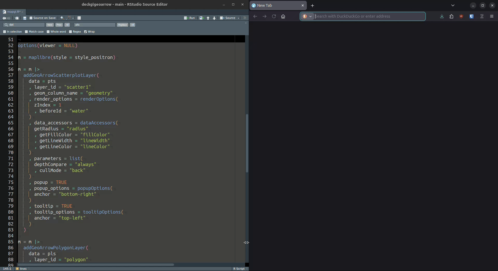

<!-- README.md is generated from README.Rmd. Please edit that file -->

```{r, include = FALSE}
knitr::opts_chunk$set(
  collapse = TRUE,
  comment = "#>",
  fig.path = "man/figures/README-",
  out.width = "100%"
)
```

# deckglgeoarrow

<!-- badges: start -->
[](https://github.com/r-spatial/deckglgeoarrow/actions/workflows/R-CMD-check.yaml)
<!-- badges: end -->

## About

Easy and efficient rendering of very large geospatial data in the browser.

`deckglgeoarrow` provides functionality to efficiently visualise potentially
very large geospatial data as [`Deck.gl`](https://deck.gl/) layers on top of a
[`maplibre`](https://maplibre.org/projects/gl-js/)/[`mapbox`](https://www.mapbox.com/) 
map created with package [`mapgl`](https://walker-data.com/mapgl/). 

For very quick and efficient data transfer from R memory to the browser,
[`geoarrowWidget`](https://r-spatial.github.io/geoarrowWidget/) is used. Layer 
creation is done in 'JavaScript' using [`geoarrow/deck.gl-geoarrow`](https://github.com/geoarrow/deck.gl-geoarrow)
(see [Features](https://github.com/geoarrow/deck.gl-geoarrow#features) section
for details on how and why layer creation is efficient).

## Features

Currently, `(MULTI)POINT`, `(MULTI)LINESTRING` and `(MULTI)POLYGON` features are 
supported by the following layer functions:

* [`addGeoarrowScatterplotLayer`](https://r-spatial.github.io/deckglgeoarrow/reference/addGeoArrowScatterplotLayer.html) for point data
* [`addGeoarrowPathLayer`](https://r-spatial.github.io/deckglgeoarrow/reference/addGeoArrowPathLayer.html) for linestring data
* [`addGeoarrowPolygonLayer`](https://r-spatial.github.io/deckglgeoarrow/reference/addGeoArrowPolygonLayer.html) for polygon data

Support for other layers, such as `discrete global grid` layers (`S2`, `A5`, `H3`),
`origin-destination` layers (`Arc`, `trips`) and `point-cloud` layers, 
among others, will follow.

## Supported data sources

#### R

Spatial classes from the following R packages are supported (via `data` argument):

* [`wk`](https://paleolimbot.r-universe.dev/wk)
* [`sf`](https://r-spatial.r-universe.dev/sf)
* [`geos`](https://paleolimbot.github.io/geos/)
* [`terra`](https://rspatial.r-universe.dev/terra)

#### Others

The following local or remotely hosted files types are supported (via `file`/`url` argument):

* [`GeoArrow`](https://geoarrow.org/)
* [`GeoParquet`](https://geoparquet.org/)

Note, that due to a [restriction](https://github.com/geoarrow/deck.gl-geoarrow/issues/170) in the upstream JavaScript dependency, only files
with native `GeoArrow` geometry encoding are supported. `WKB` encoded geometries
will not render!

In addition, [`nanoarrow`](https://apache.r-universe.dev/nanoarrow) `array_streams` (as files) are supported.

## Installation

The development version of deckglgeoarrow can be installed from [GitHub](https://github.com/r-spatial/deckglgeoarrow) with:

```r
# install.packages("pak")
pak::pak("r-spatial/deckglgeoarrow")
```

## Example

To showcase what the package can do, consider [this](https://raw.githubusercontent.com/r-spatial/deckglgeoarrow/refs/heads/main/inst/experiments/mapgl.R) example.

Here, we visualise 

* 1M random points with random sizes and colors +
* ~11k polygons colored by river basin + 
* ~155k lines colored and sized according to their [Strahler number](https://en.wikipedia.org/wiki/Strahler_number)

in one map.

Here's how quickly this renders:



More examples can be found [here](https://github.com/r-spatial/deckglgeoarrow/tree/main/inst/experiments)

### Acknowledgment

This project has been realized with financial [support](https://r-consortium.org/all-projects/2025-group-2.html#modernizing-rs-web-mapping-capabilities) from the

<a href="https://r-consortium.org/all-projects/2025-group-2.html#modernizing-rs-web-mapping-capabilities">

</a>
